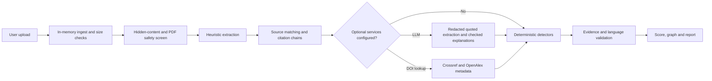

# DataDoctor

> Before you trust the evidence, investigate the evidence behind it.

DataDoctor reviews a report and its cited documents. It extracts claims and references, checks whether citations lead back to shared sources, identifies methodological limitations and funding relationships, checks basic PDF safety signals, and reveals hidden instructions aimed at automated reviewers. Each displayed finding links to an exact document quote or a public record.

DataDoctor does not tell you what to believe. It tells you what to investigate before you believe it.

## Run locally

Requirements: Node.js 20 or newer.

```sh
npm ci
cp .env.example .env.local # optional; leave values empty for offline analysis
npm run dev
```

Open `http://localhost:3000`. Select a PDF, TXT, or Markdown report and optional cited sources, or run either fictional demo case. The low-score chemistry example includes a tiny-font hidden instruction. The clean sea otter example has no flagged concerns and scores 100. Both are available as downloads and are marked fictional.

Commands:

```sh
npm run typecheck
npm test
npm run build
npm start
npm run smoke # after build; starts a production server on port 3100
```

Uploads are processed in memory. Each file is limited to 10 MB, all files together to 25 MB, with at most six files. PDF text extraction processes at most the first 40 pages. Scanned-image PDFs return a clear message because OCR is not supported.

## Optional services

The app works with all values empty. Set values in `.env.local` for local development or in the hosting dashboard:

| Variable | Purpose |
| --- | --- |
| `LLM_BASE_URL` | Base URL for an OpenAI-compatible chat completions API |
| `LLM_API_KEY` | Credential for that API |
| `LLM_MODEL` | Model name accepted by the configured API |
| `OPENALEX_MAILTO` | Contact email for optional OpenAlex and Crossref DOI checks |
| `ELEVENLABS_API_KEY` | Optional text-to-speech credential |
| `ELEVENLABS_VOICE_ID` | Voice identifier for optional spoken briefings |

All variables are listed with empty values in `.env.example`. LLM extraction sends redacted document text inside untrusted-data delimiters. Proposed quotes are checked against extracted text before use. The LLM can suggest wording, but deterministic code decides findings and scores. DOI enrichment sends DOI identifiers to Crossref and OpenAlex. Failed or slow services fall back to local analysis.

## Architecture



Core modules live in `src/lib/pipeline/`; detectors are in `src/lib/detectors/`. API routes use Node.js runtime. `GET /api/health` is an immediate readiness check. `GET /api/demo` runs the low-score case through the pipeline; `GET /api/demo?case=clean` runs the clean sea otter case. Neither returns precomputed findings.

## Findings and scoring

Each finding has one label: `FACT`, `POTENTIAL_CONCERN`, `INTERPRETATION`, or `UNKNOWN`. Findings without a verified quote or a public-record URL are removed before display. Uploaded text is rendered as text, never as HTML.

The report is organized around seven review factors. Coverage is shown for every factor so a score is never presented as proof that a claim, dataset, author, or source is trustworthy. `Not assessed` factors are excluded from the overall screening signal.

| Review factor | Coverage | Signals included in its partial score |
| --- | --- | --- |
| Bias | Partial | Narrow generalized samples; causal wording in survey or observational research |
| False claims | Partial | Numeric disagreement between a claim and supplied cited documents or a labeled excerpt in the report; no independent fact-checking |
| False evidence | Partial integrity screen | Hidden instructions, risky file features, untraced statistics, and supplied-source disagreement; no authenticity verdict |
| Corrupt data | Partial | A simple total-versus-itemized count check; no raw data or provenance validation |
| AI-based claims | Partial | Hidden instructions aimed at AI reviewers; no AI-authorship classifier |
| Author & conflict check | Partial | Disclosed funding, commercial relationships, and extracted affiliation statements |
| Source quality | Partial | Citation matching, untraced statistics, source disagreement, and shared underlying sources; no source reputation score |

For scored factors, each starts at 100 and receives severity-weighted deductions from the following signals. Scores are clamped to 0–100.

| Review factor | Finding type | Base points |
| --- | --- | ---: |
| Bias | Sampling limitation | 60 |
| Bias | Causal language | 14 |
| False claims | Claim-source discrepancy | 78 |
| False evidence | Hidden instruction | 28 |
| False evidence | File safety flag | 38 |
| False evidence | Untraced statistic | 14 |
| False evidence | Claim-source discrepancy | 15 |
| Corrupt data | Data count inconsistency | 68 |
| AI-based claims | Hidden instruction | 68 |
| Author & conflict check | Funding conflict | 64 |
| Author & conflict check | Funding statement not found | 24 |
| Source quality | Untraced statistic | 50 |
| Source quality | Evidence dependency | 28 |
| Source quality | Claim-source discrepancy | 30 |

| Severity | Multiplier |
| --- | ---: |
| High | 1.00 |
| Medium | 0.80 |
| Low | 0.50 |
| Info | 0.35 |

The overall number is the rounded mean of the seven partial numeric factors above. It is a rough screening signal, not a measure of truth, bias, data integrity, or trustworthiness, and it has not been scientifically validated. A high number does not clear a document. Disclosed AI use is informational and does not lower a score. A source discrepancy means the supplied documents disagree; it does not establish which figure is correct. A count inconsistency is an arithmetic check, not proof of tampering. The bundled chemistry sample is clearly marked fictional and intentionally contains these review signals.

DataDoctor does not call a claim false solely because its source is missing, nor does it label evidence fabricated or data corrupt without validation. Author names and affiliations are extracted from document text and optional public metadata; they are not credential or background checks. Source checks establish citation links and metadata only, not whether a publisher or author is authoritative.

## Security and privacy

- Files stay in process memory and are not written to disk. The application does not log document text or load analytics and third-party scripts.
- Magic bytes are checked before parsing. PDFs are scanned for `/JavaScript`, `/JS`, `/OpenAction`, `/Launch`, `/EmbeddedFile`, and `/Encrypt`; encrypted PDFs are rejected. PDF actions are not executed.
- Hidden text is screened before extraction and excluded from heuristic and LLM inputs. Detectors and scoring are deterministic.
- Before external text calls, emails, phone numbers, street addresses, and long ID-like numbers are redacted. Author and organization names are retained for analysis. A privacy receipt lists external calls and redaction counts.
- Analysis and briefing endpoints have an in-memory limit of 10 requests per minute per client IP. The limit is process-local and resets on restart.
- Production responses include a Content Security Policy and related browser security headers.
- Uploaded text is never rendered as HTML. The source contains no `dangerouslySetInnerHTML`.

The PDF safety scan is a narrow byte-pattern check, not a malware scanner. It does not detect white text. Tiny-font detection uses extracted PDF text item height and may miss unusual encodings or layout tricks. Invisible Unicode and HTML comments are checked in supported text and PDF-extracted text. OCR is not supported, and scanned-image PDFs cannot be reviewed. In-memory processing does not protect a compromised host or network connection; deploy behind trusted infrastructure.

## Real and optional behavior

Local heuristics, PDF/text ingestion, hidden-instruction checks, sampling and causal-language checks, source-chain matching, scoring, evidence validation, privacy receipts, and the evidence graph work without credentials. The demo records and all people, organizations, products, and data in the fixtures are invented.

LLM claim extraction and plain-language explanation require the three LLM variables. Crossref and OpenAlex lookup require `OPENALEX_MAILTO` and cited DOI values. Spoken briefings require ElevenLabs credentials. The app uses the current `POST /v1/text-to-speech/{voice_id}?output_format=mp3_44100_128` endpoint with `eleven_multilingual_v2`; see the [ElevenLabs text-to-speech API reference](https://elevenlabs.io/docs/api-reference/text-to-speech/convert). Optional services may be unavailable; local findings remain available when a service request fails.

## Fictional demo and ethics

The sample case is synthetic and makes no claims about real people, organizations, products, or studies. It exists to demonstrate repeated-source dependence, funding relationships, a narrow sample, statistics without matched sources, causal language, and hidden AI-targeted text.

This tool supports investigation, not accusation. A documented funder relationship or methodological limitation does not establish misconduct or invalidate a result. Review the underlying evidence, contact authors when appropriate, and seek independent expertise before making consequential decisions. Do not use automated findings as a substitute for professional, scientific, or legal judgment.

## Deploy on Deployxa

1. Connect the GitHub repository in Deployxa. Next.js is auto-detected.
2. Set the build command to `npm run build`.
3. Set the start command to `npm start`.
4. Add only the optional environment variables you want in the dashboard.
5. Deploy. The server reads the platform `PORT` value and exposes `/api/health` for health checks.
